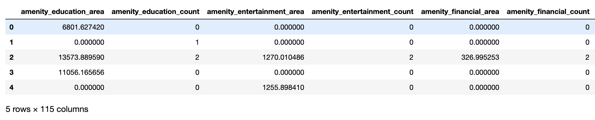
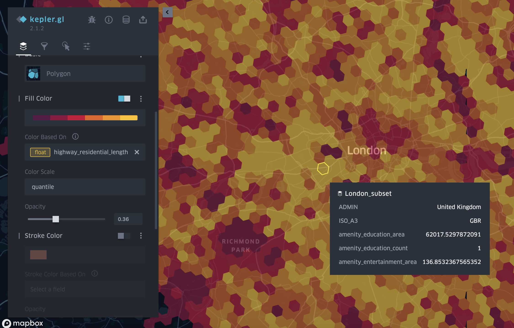

# OSM Feature Extractor

## Introduction

Lightweight application to automatically extract features from an OSM file, and map them to 
user defined GeoJSON polygon(s). The mapped features can then be potentially used for machine learning applications based
on OSM data. The extracted features can be a `count` for nodes, a `length` for ways and `area` for areas. The main 
features extracted are:

**`amenity`** <br>
**`building`** <br>
**`craft`** <br>
**`cycleway`** <br>
**`emergency`** <br>
**`highway`** <br>
**`historic`** <br>
**`landuse`** <br>
**`leisure`** <br>
**`man_made`** <br>
**`military`** <br>
**`natural`** <br>
**`office`** <br>
**`power`** <br>
**`public_transport`** <br>
**`railway`** <br>
**`shop`** <br>
**`sport`** <br>
**`tourism`**

For more details on the features that are extracted, check [FEATURES.md](feature_extractor/feature_augmenting/FEATURES.md) and 
the [OSM wiki](https://wiki.openstreetmap.org/wiki/Map_Features).

Example generated dataframe:



Data visualised on a map:



## Usage

After cloning the project into your local machine, the first thing will be to create a virtual environment with 
the required packages. For this, it is highly recommended to use conda, as it will make sure all packages can be 
installed. Thus, run:

```shell script
$ conda env create -f environment.yml

$ conda activate osm-feature-extractor 
```

in order to run the app do:

```shell script
$ python feature_extractor/main.py
```

The above command will run on an included OSM file `isle-of-wight-latest.osm.pbf` and `isle-of-wight.geojson`.

You can go to [configuration file](proj.conf) in order to adjust the app configuration parameters. 
The main ones are detailed below:

**osm_file**: Name of osm file whose features will be extracted. To download more files visit the 
[geofabrik](https://download.geofabrik.de/) website. <br>
**input_data_file**: Name of file containing GeoJSON polygon(s) to be map the features against. <br>
**out_file**: Path to the output file where all features will be extracted to. <br>

**Note**: _Large files might take a while to process. It is recommended to use the CLI
[osmium extract](https://docs.osmcode.org/osmium/latest/osmium-extract.html) tool in order to reduce the OSM file to the 
area of interest first and then run the feature extractor._

`

