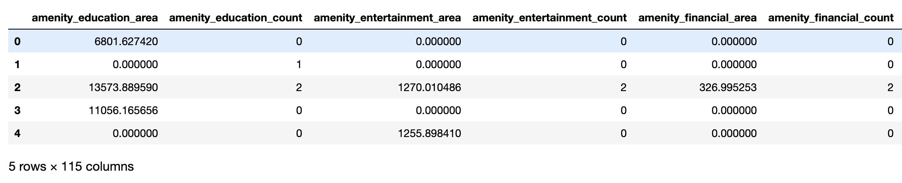
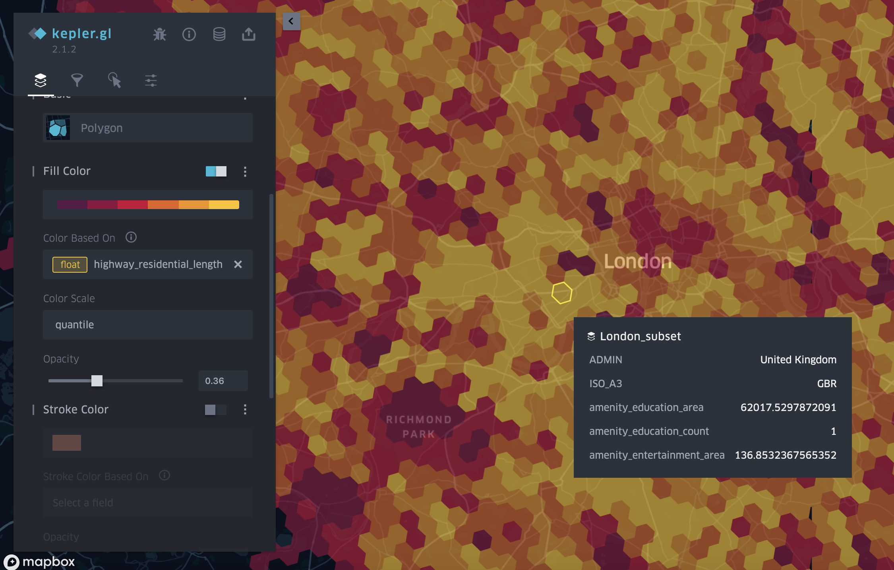

# OSM Feature Extractor 

[](https://badge.fury.io/py/osm-feature-extractor)

A lightweight application designed to automatically extract features from an OpenStreetMap (OSM) 
file and map them to a user-defined GeoJSON file containing a collection of polygons. 
The extracted features can include `count` for nodes, `length` for ways, and `area` for areas. 
These features can then be used for machine learning applications based on OSM data.

For more details on the features that are extracted, check [FEATURES.md](FEATURES.md) and 
the [OSM wiki](https://wiki.openstreetmap.org/wiki/Map_Features).

Example generated dataframe:



Data visualised on a map:



## Installation

    $ pip install osm-feature-extractor

## Usage

After installation, you can use the tool directly with the `osm_feature_extractor` command, 
which supports two primary operations: `extract` and `analyze`.

### `extract`

The `extract` command requires a minimum of three flags:

    $ osm_feature_extractor extract \
        --osm-file <path_to_osm_file> \ 
        --input-polygons-file <path_to_polygons_file> \
        --output-file <path_to_output_file>

To see all available flags, use the help command:

    $ osm_feature_extractor extract --help

Alternatively, you can provide a `.conf` file with the required parameters:

    $ osm_feature_extractor extract --conf-file <path_to_conf_file>

The configuration file should have the following format:

```shell
[user-defined]
osm_file: <path_to_osm_file>
input_polygons_file: <path_to_polygons_file>
output_file: <path_to_output_file>

[default]
process_base_data: True
process_osm_data: True
polygons_file: polygons.geojson
osm_extractor_files_dir: osm_extractor_files_dir
```

**Note**: _Processing large OSM files may take some time. It is recommended to use the CLI tool [osmium extract](https://docs.osmcode.org/osmium/latest/osmium-extract.html)
to reduce the OSM file to your area of interest before running the feature extractor._

### `analyze` 

The `analyze` command provides a quick overview of the OSM file, including the total number of nodes, 
ways, bounds, and the centroid. To use this feature, run:

     $ osm_feature_extractor analyze --osm-file <path_to_osm_file>
